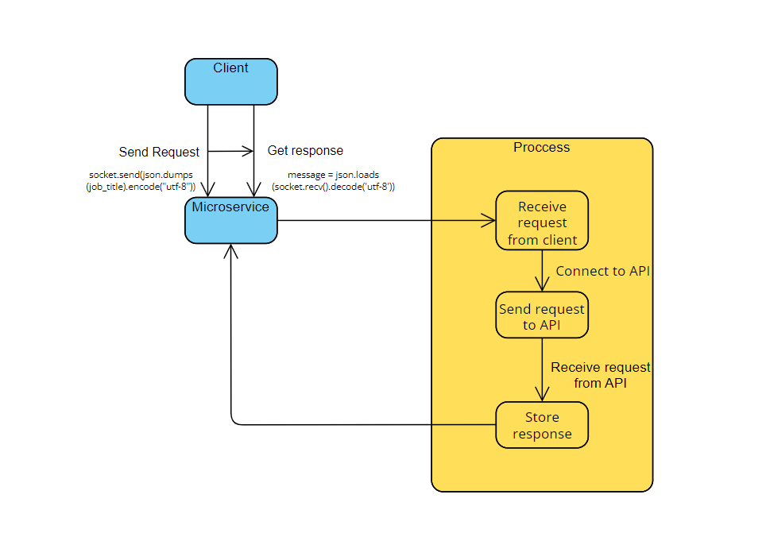

# osu_cs361_partner_microservice
>The file that is sending and reciving data to the microservice must use ZMQ and have the following lines of code to work:

  import zmq
  import json
  
  context = zmq.Context()
  
  # socket to talk to server
  socket = context.socket(zmq.REQ)
  socket.connect("tcp://localhost:5555")

>Clear instructions for how to programmatically REQUEST data from the microservice you implemented. Include an example call.
  To send a REQUEST, you will utlize the code below and insert a string or a variable conatining a string, of the job title you wish to pull data for:
    job_title = 'python'
    socket.send(json.dumps(job_title).encode("utf-8"))
    OR
    socket.send(json.dumps('python').encode("utf-8"))

>Clear instructions for how to programmatically RECEIVE data from the microservice you implemented.
  After making the REQUEST, you will utilize the code below to RECEIVE the data:
    message = json.loads(socket.recv().decode('utf-8'))
  The 'message' variable will now hold a dictionary containing the needed avaliable job information.

>UML sequence diagram showing how requesting and receiving data works. Make it detailed enough that your partner (and your grader) will understand

